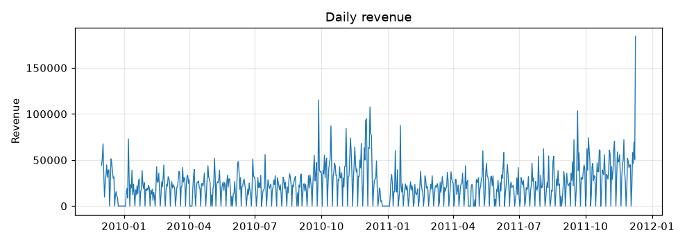
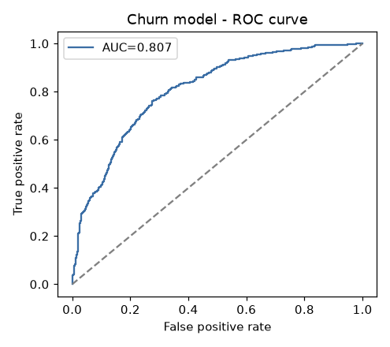
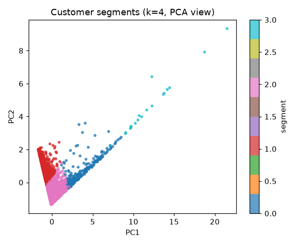

# Customer Intelligence Engine

An end-to-end customer-analytics system for a retail business, built as a single
cohesive project that exercises the **entire classical machine-learning toolkit** —
from SQL feature engineering to a deployed Streamlit app.

> **One dataset, five business questions:** *Who is valuable? Who will churn? How do
> customers cluster? What sells together? And what did our promotion actually do?*

Built on the real **Online Retail II** dataset (1M+ UK e-commerce transactions). The
pipeline also runs on bundled synthetic data if the real file isn't present.

---

## What it demonstrates

| Capability | Where | Skills |
|---|---|---|
| SQL feature engineering | `src/data_prep.py` | `GROUP BY`, CTEs, **window functions** (`RANK`) on an in-memory SQLite DB |
| Data cleaning & prep | `src/data_prep.py`, `src/model_utils.py` | missing values, outlier capping, one-hot encoding, scaling, train/test discipline |
| Hypothesis testing | `src/stats_tests.py` | Welch's t-test, chi-square test of independence |
| Regression (CLV) | `src/regression.py` | linear regression, regression tree, random forest, R²/MAE/RMSE, cross-validation |
| Classification (churn) | `src/classification.py` | logistic regression, tree, forest, KNN, precision/recall, ROC-AUC, threshold tuning |
| Pipelines + tuning | `regression.py`, `classification.py` | `Pipeline`, `ColumnTransformer`, `GridSearchCV` |
| Unsupervised | `src/segmentation.py` | RFM features, K-Means, silhouette score, PCA |
| Association rules | `src/association_rules.py` | Apriori market-basket analysis (support, confidence, lift) |
| Causal impact | `src/causal_impact.py` | counterfactual estimation of an event's effect |
| Deployment | `app/streamlit_app.py` | multi-page Streamlit app serving the saved models |

---

## Results (on the real Online Retail II data)

- **5,281** customers modelled · churn rate **~57%**
- **Churn classifier:** ROC-AUC **0.81**, recall **0.84** (threshold tuned to 0.40)
- **CLV regression:** R² **0.49** on the test set (cross-validated R² 0.54)
- **Segments:** 4 (VIP/wholesale, Champions, Loyal mid-value, At-risk)
- **Association rules:** 56 found — e.g. the green Regency teacup → the pink one (lift ~22×)
- **Hypothesis test:** non-UK customers have significantly higher average order value (p < 0.001)





---

## Repo structure

```
customer-intelligence-engine/
├── README.md
├── requirements.txt
├── data/
│   ├── raw/                  # put online_retail_II.csv here (gitignored)
│   └── README.md
├── src/
│   ├── config.py             # paths, constants, feature schema (one source of truth)
│   ├── generate_synthetic.py # fallback data with the same columns
│   ├── data_prep.py          # load + clean + SQL feature engineering + time split
│   ├── model_utils.py        # shared preprocessing pipeline (impute/scale/encode)
│   ├── eda.py                # exploratory plots
│   ├── stats_tests.py        # t-test + chi-square
│   ├── regression.py         # CLV models + GridSearchCV + feature importance
│   ├── classification.py     # churn models + ROC + threshold tuning
│   ├── segmentation.py       # RFM + K-Means + PCA
│   ├── association_rules.py  # Apriori market basket
│   ├── causal_impact.py      # event counterfactual
│   └── train_all.py          # orchestrates everything, saves artifacts
├── app/
│   └── streamlit_app.py      # 5-page dashboard
├── models/                   # saved models + summaries (created by train_all)
└── reports/figures/          # saved plots (created by train_all)
```

---

## Quickstart

```bash
# 1. install
python -m venv .venv && source .venv/bin/activate    # Windows: .venv\Scripts\activate
pip install -r requirements.txt

# 2. add the data: put online_retail_II.csv into data/raw/  (no renaming needed)

# 3. build everything (trains models, writes figures + summaries). ~1 min.
python -m src.train_all

# 4. launch the dashboard
streamlit run app/streamlit_app.py
```

Each stage is runnable on its own while you learn:

```bash
python -m src.data_prep        # inspect the customer table
python -m src.regression       # just the CLV models
python -m src.classification   # just the churn models
python -m src.segmentation
python -m src.association_rules
python -m src.causal_impact
```

---

## How a few of the trickier parts work

**Time-based split (no leakage).** Features come only from transactions *before* a
split date; targets come from the `HOLDOUT_DAYS` after it. Future spend is the
regression target; "no purchase in the holdout" is the churn label.

**Pipelines everywhere.** Imputation, scaling, and one-hot encoding live *inside* the
sklearn `Pipeline`, so identical transforms apply at training and when the app scores
a new customer.

**Causal impact.** The bundled version fits a model of daily revenue on a trend +
day-of-week using only the pre-event period, projects it through the event window,
and attributes the gap to the event. Point `event_start` at a real campaign date when
using real data; for a production version, swap in the `causalimpact` library.

## Skills demonstrated (recruiter summary)

SQL · pandas/numpy · data cleaning & feature engineering · statistical testing ·
regression & classification · model evaluation & threshold tuning · hyperparameter
tuning · clustering & PCA · association-rule mining · causal analysis · sklearn
Pipelines · deployment with Streamlit · clean, modular, reproducible project structure.
